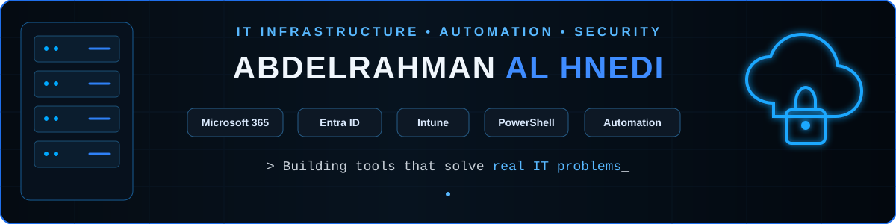
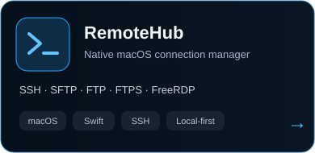
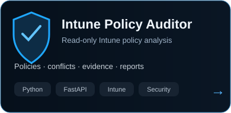
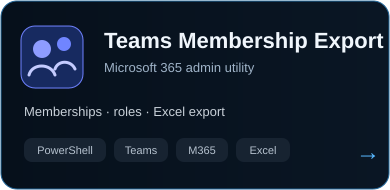

 

---

<table>
<tr>
<td width="48%" valign="top">

## 👨‍💻 About Me

IT professional focused on **modern infrastructure, Microsoft cloud technologies, automation and security**.

I like turning repetitive administration into reliable tooling and building practical solutions for real IT environments.

**Focus**
- Microsoft 365 & Entra ID
- Intune & Modern Workplace
- Active Directory & hybrid infrastructure
- PowerShell & automation
- Security & configuration management
- APIs, Docker & internal tooling

</td>
<td width="52%" valign="top">

## 🚀 Currently Building

**Identity Management Platform**  
  
Onboarding, identity lifecycle and workflow automation.

**RemoteHub**  
  
Native, local-first macOS connection manager.

**Intune Policy Auditor**  
  
Read-only policy analysis and configuration evidence.

**Automation Tooling**  
  
PowerShell and Microsoft 365 administration utilities.

</td>
</tr>
</table>

---

## 🧰 Tech Stack

 

---

## ⭐ Featured Projects

---

## 🐍 Contribution Activity

<picture>
  <source media="(prefers-color-scheme: dark)" srcset="https://raw.githubusercontent.com/abderlahmanalhnedi/abderlahmanalhnedi/output/github-contribution-grid-snake-dark.svg">
  <source media="(prefers-color-scheme: light)" srcset="https://raw.githubusercontent.com/abderlahmanalhnedi/abderlahmanalhnedi/output/github-contribution-grid-snake.svg">
  
</picture>

---

## 📊 GitHub

  

[**View all repositories →**](https://github.com/abderlahmanalhnedi?tab=repositories)

---

### ⚡ Automate the boring stuff. Understand the infrastructure. Build better tools.

IT Infrastructure · Microsoft Cloud · Automation · Security

